```mermaid
---
config:
  look: classic
  layout: elk
---
flowchart TD
    A["💡 Discovery Process"] -- User Request --> B["📥 Accept Input"]
    B -- Uses Mock --> M["📂 Mock Directory"]
    B -- Search Needed --> S["🔍 Search global/local node_modules"]
    S --> MA["📑 Identify Matching Actions"]
    MA -- Language/Format Criteria --> C1["📝 Language/Format"]
    MA -- Specific Actions --> C2["⚙️ Specific Actions"]
    M -- Skip Search --> V["🏗️ Validate & Verify"]
    C1 --> V
    C2 --> V
    V -- Check Required Fields --> V1["🔍 Check Meta Info"]
    V -- Check Structure --> V2["🛠️ Check Action Object"]
    V -- Check Terms --> V3["📜 Check Contract Terms"]
    V1 --> AOK["✅ Action Approved"]
    V2 --> AOK
    V3 --> AOK
    B@{ shape: decision}
```

Discovery, in BeDoc, is about finding actions to handle your request.
It is designed with the intent of enabling the pluggable nature of
the ecosystem.

As such, it provides for specifying language and format, rather than
a specific parser or printer. But, it does not prohibit specificity.

During the discovery process, BeDoc will:

1. accept your
   1. `mock` directory, *or*
   2. any configuration expression of
      1. language and/or format directives, and/or
      2. parser and/or printer directives
   3. Search the global NPM `node_modules`
   4. Search the local project's **`node_modules`**
2. review all findings and ensure that each
   1. has proper [`meta`](/actions#actions) information
   2. has a valid [`action`](/actions#actions) object
   3. has valid [`contract`](/actions/contracts) terms

And once it has done all of that, it takes what it has found and then
finds a pairing that will get the job done. If it finds more than one
pairing, BeDoc will error. If it founds no pairing, BeDoc will error.
Play nice with BeDoc, it is sensitive.

Also, here's a Mermaid drawing of the Discovery process. That there
are no mermaids is incredibly disappointing.

