# Discovery in BeDoc

Discovery in BeDoc is the process of locating the right actions to handle your request. Instead of requiring you to manually specify a parser or printer, BeDoc allows you to define **what** you need in terms of language and format, and it will take care of **how** that need is fulfilled.

However, if you prefer to be explicit, you can still specify a particular parser or printer—Discovery won’t stand in your way.

## How It Works
During the Discovery process, BeDoc will:

1. **accept your input**, which may include:
   - a `mock` directory, *or*
   - any configuration expression specifying:
     - language and/or format directives
     - parser and/or printer directives
2. **search for applicable actions** within:
   - the global NPM `node_modules`
   - the local project's **`node_modules`**
3. **validate all findings**, ensuring that each:
   - contains proper [`meta`](/actions#actions) information
   - defines a valid [`action`](/actions#actions) object
   - adheres to [`contract`](/actions/contracts) terms

:::warning[Configure Decisively]

Once BeDoc has compiled all viable options, it attempts to pair a parser with a printer. However, BeDoc does **not** do indecision:

- if it finds more than one pairing, it errors.
- if it finds no valid pairings, it errors.
- BeDoc does not handle ambiguity well. Handle with care.

:::

## The Discovery Flowchart

Also, here’s a **Mermaid diagram** representing the Discovery process.
_(That there are no actual mermaids involved remains a source of deep disappointment.)_

```mermaid
---
config:
  look: classic
  layout: elk
---
flowchart TD
    A["💡 Discovery Process"] -- User Request --> B["📥 Accept Input"]
    B -- Uses Mock --> M["📂 Mock Directory"]
    B -- Search Needed --> S["🔍 Search global/local node_modules"]
    S --> MA["📑 Identify Matching Actions"]
    MA -- Language/Format Criteria --> C1["📝 Language/Format"]
    MA -- Specific Actions --> C2["⚙️ Specific Actions"]
    M -- Skip Search --> V["🏗️ Validate & Verify"]
    C1 --> V
    C2 --> V
    V -- Check Required Fields --> V1["🔍 Check Meta Info"]
    V -- Check Structure --> V2["🛠️ Check Action Object"]
    V -- Check Terms --> V3["📜 Check Contract Terms"]
    V1 --> AOK["✅ Action Approved"]
    V2 --> AOK
    V3 --> AOK
    B@{ shape: decision}
```

